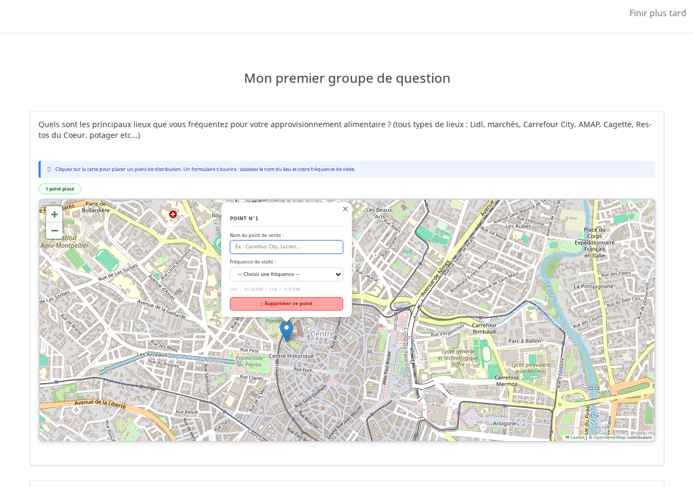

# MultiPointMapper v1.0 — Question theme for LimeSurvey

A LimeSurvey question theme that lets respondents place **multiple points on an interactive map** (Leaflet + OpenStreetMap), each annotated with a name and a visit frequency.

Developed at INRAE for surveying short food supply chain locations.

Inspired by [LimeSurvey-Signature-Question](https://github.com/adamzammit/LimeSurvey-Signature-Question) by Adam Zammit.




**Live demo:** [questionnaire.obsat.org](https://questionnaire.obsat.org/index.php/568979?lang=fr)

---

## Features

- Click anywhere on the map to place a point
- Each point opens a popup: free-text name field + configurable visit frequency dropdown
- Configurable maximum number of points (0 = unlimited)
- Responses stored as a JSON array — survives page navigation
- All map parameters configurable per question (center, zoom, frequency options)
- Compatible with LimeSurvey 4.x, 5.x, 6.x

## Installation

### LimeSurvey 6.x (GUI)

1. Download the latest release zip (`MultiPointMapper_v1.0.zip`)
2. In LimeSurvey admin: **Configuration → Themes → Question themes → Import**
3. Upload the zip — the theme `multipointmapper` is now available

### LimeSurvey 4.x / 5.x (manual)

Extract the zip so that the `multipointmapper` folder ends up at:

```
limesurvey/survey/questions/answer/shortfreetext/multipointmapper/
```

## Usage

Apply the theme to any **Short free text** question. Four custom attributes are available in the question editor:

| Attribute | Default | Description |
|---|---|---|
| `mpm_max_points` | `0` | Maximum number of points (0 = unlimited) |
| `mpm_frequency_options` | `Tous les jours;Plusieurs fois par semaine;...` | Semicolon-separated frequency labels |
| `mpm_map_center` | `43.6119, 3.8778` | Initial map center (lat, lng) |
| `mpm_default_zoom` | `12` | Initial zoom level |

## Response format

Responses are stored as a JSON array in the answer field:

```json
[
  { "id": 1, "lat": 43.6119, "lng": 3.8778, "name": "Marché du Lez", "freq": "Une fois par semaine" },
  { "id": 2, "lat": 43.5800, "lng": 3.8500, "name": "AMAP des Pins",  "freq": "Tous les jours" }
]
```

## License

GPL v3 — see [LICENSE](LICENSE)

## Author

Grégori Akermann — INRAE
